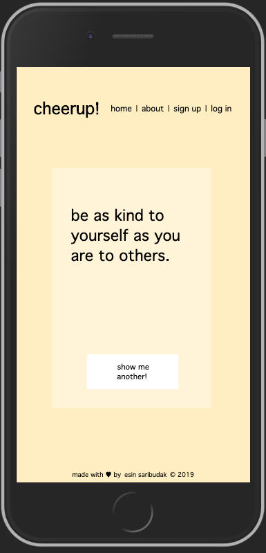

# cheerups!


This app will cheer you up. The Internet can always use more kindness. Sometimes we're our own harshest critic. This corner of the Internet is for positive vibes, only.

## Description

This project was designed to fulfill the requirements for General Assembly's Project 2 in the Software Engineering Immersive Remote program. Cheerup! is my first fullstack web application, built by me from the ground up.

## Features

Currently at the Silver level: project includes all the features of my Bronze/MVP plan as well as user registration so that authenticated users can create, edit and delete cheerups.

## Planning

#### User Stories

The user stories for this application can be found [here](https://github.com/esin87/cheerup/blob/master/planning/user_stories.md). In short, the user wants to see "cheerups" -- short, positive, and inspiring quotes that cheer up the reader.

#### Project Management

I used [Trello](https://trello.com) to break the project into tasks and create to-do lists for each task. This not only allowed me to break larger tasks down into bite-size chunks, but seeing the overall progress as I moved more items into the "done" category was highly motivating.

I also planned Bronze (Minimum Viable Product), Silver, and Gold versions of the app:

- **Bronze (Minimum Viable Product):** Meets minimum project requirements. Built using Express, Handlebars, and Mongoose. Has one non-user model (cheerups). Has full CRUD functionality on cheerup model by any user. Repositoried in GitHub, deployed via Heroku, with validated HTML and CSS.
- **Silver:** Add user model to database with Passport authentication, so that registered users are the only ones who can create, update, and delete cheerups.
- **Gold:** Build out user model further so that a registered user can like cheerups and save them to a liked collection, and also save their own created cheerups to their personal collection.

#### Wireframing

I used Balsamiq to create the wireframes for each view (an example [here](https://github.com/esin87/cheerup/blob/master/planning/cheerup!%20wireframes/Show%20Me%20a%20Cheerup%20View.png)). These are rough sketches of what I want the finished product to look like.

## Technical Details

#### Backend

Cheerup! runs on a NodeJS/Express server with MongoDB/Mongoose. The file architecture follows the Model-View-Controller schema. Below is an excerpt from my cheerups controller file.

```javascript
//show random cheerup to unregistered users
router.get('/show', (req, res) => {
	//use aggregate sample method to return random cheerup
	Cheerup.aggregate([{ $sample: { size: 1 } }])
		.then(cheerup => {
			return cheerup[0];
		})
		.then(cheerup => {
			res.render('showcheerup', { cheerup });
		})
		.catch(err => console.error(err));
});
```

The app was deployed using Heroku and MongoDB Atlas. Users can sign up for an account using Passport authorization. Registered users have full CRUD functionality implemented with RESTful routes.

#### Frontend

Handlebars was used to handle page templates with HTML. A static CSS style file is also included. Vanilla JavaScript and DOM manipulation was used to create user-interactions on individual pages, such as the changing background color or word counter. CSS and HTML validators were used to check the code. The styling is also responsive to smaller mobile screens through the use of a media query, as seen below.



#### Other Technical Details

The code was written in Visual Studio Code. The Prettier, Code Spell Checker, and Bracket Pair Colorizer extensions helped keep my code organized and functional.

## Installation Instructions

This application is fully deployed and can be used by anyone with a browser at this [link](https://esins-cheerup-app.herokuapp.com/cheerups/).

To test out the code yourself, clone this repository to your local machine. You should already have Node, Nodemon, and MongoDB installed globally on your computer. Then in terminal, in the project directory, run "npm install" in the CLI to download the Node packages needed for this program. In a separate CLI tab, run "mongod" to initiate the Mongo database. Still in the project directory, run "node db/seed.js" in the CLI to seed the database with cheerups. Then in the CLI run "nodemon index.js". If you open a browser window and navigate to "localhost:8080/" you will be able to run the program while it's hosted on your own computer.

## Unsolved Problems

- The log-in page does not check that the email address is actually an email address. Users can enter any string of characters into the "email" field and be allowed to register. I need to figure out how to write logic in my Passport code that checks that the entry is an email address.

## Future Directions

- Complete Gold level plan
- Adding OAuthorize
- Allowing registered users to view the cheerups! of other users.
